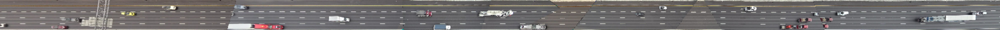
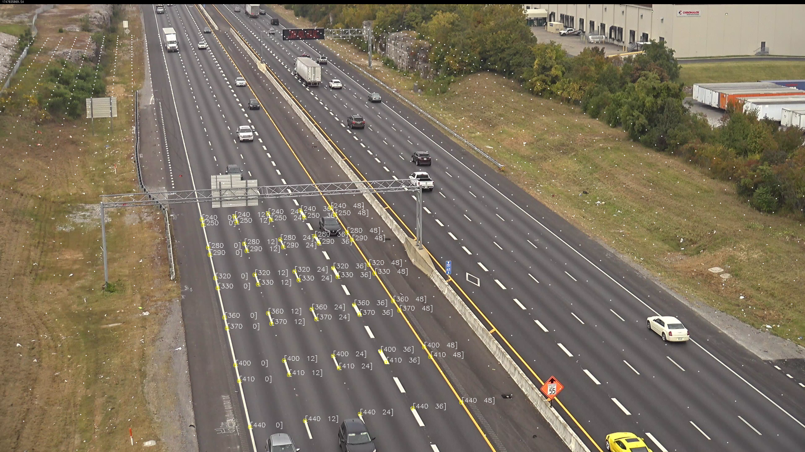

# i24-roadway-transforms

First and foremost, I appologize the documentation for this is bad. I didn't have much time and eventually will make more workable instructions for using it. 

Initial homography points and matrices are stored in tforms, as well as images showing the transform projection. Note that these were generated by downsampling the image by a factor of 2 first, so if you need to recompute you can multiply all image points by 2 and then recompute using `cv2.findHomography()`.

To relabel an image, run `im_lcs_transform.py`. You'll first need to go and change the path at the bottom of the file to point to a video file from the desired camera.

### Labeling instructions
You need to label all of the lane lines with class 1 lines (red), and label the lane ticks with perpendicular lines (class 2, blue). Toggle between classes by pressing 1.

You can press "u" to undo the last line drawn.

In general, red lines should be labeled from W-E (so the line separating the rightmost lane out of town is labeled line 0). I would do a separate transform for the inbound and outbound sides of traffic.

In general, perpendicular lines should be labeled moving away from town. You should look at a labeled image of a previous camera to determine what the appropriate tick number should be for a given line.

After drawing a line, you can enter the tick/lane number. For perpendicular lines, you should type `X`,`Y` where X is the tick number and Y is 0 if on the NW side and 1 if it is on the SE side. Then press enter twice. If you press enter twice without entering a tick number, the software will put the sequentially next line number which is useful if you're labeling all of the lines in order.

After you've labeled all of the perp/parallel lines, press q and the computed intersection points will be shown. Press q again and the computed grid based on the transform will be shown. Press q one more time to save the transform points and image.

### Viewing
After you've computed several transforms, you can view how the camera fields of view overlap using these transforms by running `show_transformed_ims.py`. Again, you'll need to change the directory to point to a folder that has video sequences for all of the camera fields of view you'd like to show. You should also adjust ds to be whatever downsampling ratio was used earlier.

### Conversion from Local Roadway Marking Coordinate System to GPS
Use these points for now:
- 0,0      ->   36.005437, -86.610796
- 0,48     ->   36.005532, -86.610684
- ~~960,0    ->   36.002835, -86.607894
- ~~960,48   ->   36.002927, -86.607780
- 1000,0   ->   36.003404, -86.608529
- 1000,48  ->   36.003496, -86.608414
